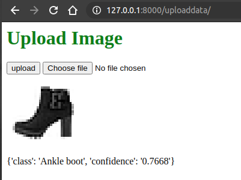

# Model Deployment in Pytorch - a Fastapi tutorial

### Usage
```bash
$ pip install -r requirements.txt
$ uvicorn 0:app --reload
```

Go to `http://127.0.0.1:8000/` and upload a fashion mnist image (white background) to see the results



**OR**

```bash
$ curl -X POST "http://127.0.0.1:8000/predict" -H "accept: application/json" -H "Content-Type: multipart/form-data" -F "file=@/home/me/Pictures/shirt.png;type=image/png"

{"class":"Coat","confidence":"0.6488"}
```
