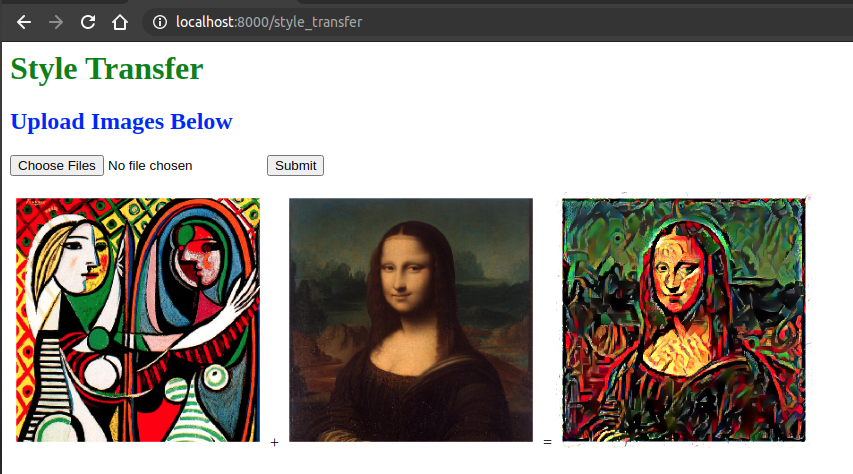

# Model Deployment in Pytorch - a Fastapi tutorial

### Usage
```bash
$ pip install -r requirements.txt
$ uvicorn 1:app --reload
```

Go to `http://127.0.0.1:8000/` and upload a style and source images and wait a minute to see the results


